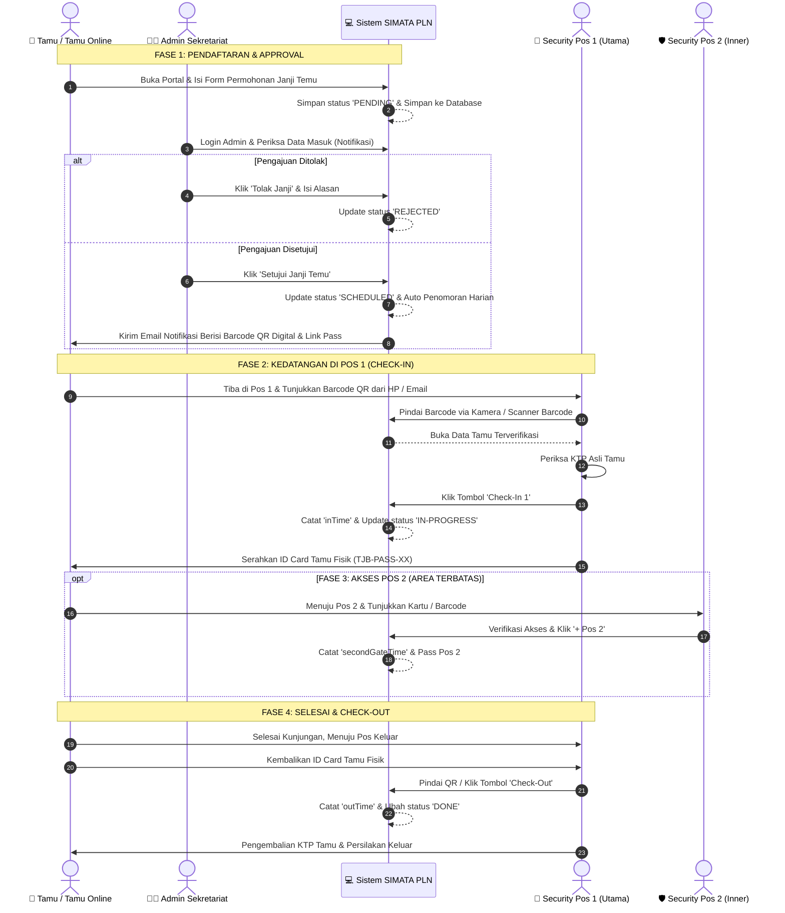

# STANDAR OPERASIONAL PROSEDUR (SOP) & FLOWCHART OPERASIONAL
## SISTEM MANAJEMEN TAMU TERPADU (SIMATA)
### PT PLN (PERSERO) UNIT INDUK PEMBANGKITAN TANJUNG JATI B

---

**Nomor Dokumen :** SOP/PLN-UIK-TJB/SEC-001/2026  
**Revisi :** 02 (Integrasi QR Barcode, Notifikasi Email Otomatis, & Penomoran Harian)  
**Tanggal Berlaku :** 28 Agustus 2026  
**Penanggung Jawab :** Sub Bidang Keamanan & Pelayanan Stakeholder (Sekretariat)  

---

## DAFTAR ISI
1. [TUJUAN & RUANG LINGKUP](#1-tujuan--ruang-lingkup)
2. [PIHAK TERKAIT & WEWENANG](#2-pihak-terkait--wewenang)
3. [FLOWCHART PROSES BISNIS END-TO-END](#3-flowchart-proses-bisnis-end-to-end)
4. [FLOWCHART SWIMLANE ANTAR PERAN](#4-flowchart-swimlane-antar-peran)
5. [PROSEDUR OPERASIONAL STANDAR (SOP)](#5-prosedur-operasional-standar-sop)
   - [5.1. Pendaftaran Kunjungan (Tamu)](#51-pendaftaran-kunjungan-oleh-tamu)
   - [5.2. Verifikasi & Persetujuan (Admin Sekretariat)](#52-verifikasi--persetujuan-oleh-admin-sekretariat)
   - [5.3. Pengiriman Kartu Akses QR & Barcode Digital](#53-pengiriman-kartu-akses-qr--barcode-digital)
   - [5.4. Pemeriksaan Kedatangan & Scan Barcode di Pos 1 (Security)](#54-pemeriksaan-kedatangan--scan-barcode-di-pos-1-security)
   - [5.5. Prosedur Masuk Pos 2 / Area Terbatas (Security Pos 2)](#55-prosedur-masuk-pos-2--area-terbatas-security-pos-2)
   - [5.6. Prosedur Check-Out / Selesai Kunjungan](#56-prosedur-check-out--selesai-kunjungan)
   - [5.7. Rekapitulasi & Pelaporan Resmi](#57-rekapitulasi--pelaporan-resmi)
6. [KONDISI KHUSUS & TROUBLESHOOTING](#6-kondisi-khusus--troubleshooting)
7. [LEMBAR PENGESAHAN DOKUMEN](#7-lembar-pengesahan-dokumen)

---

## 1. TUJUAN & RUANG LINGKUP

### 1.1. Tujuan
1. Memberikan pedoman baku dan tertib administrasi perihal alur penerimaan, pemeriksaan, dan pengawasan tamu di lingkungan instalasi objek vital nasional PT PLN (Persero) UIK Tanjung Jati B.
2. Mempercepat proses registrasi dan check-in tamu melalui pemanfaatan QR Code / Barcode digital terenkripsi.
3. Menjamin transparansi, akuntabilitas, dan pencatatan riwayat tamu secara real-time dari pintu masuk hingga keluar.

### 1.2. Ruang Lingkup
SOP ini berlaku bagi:
* Seluruh tamu eksternal (rekanan, kontraktor, dinas instansi, stakeholder, dan masyarakat umum).
* Petugas Front Office / Receptionist PLN.
* Petugas Admin Sekretariat.
* Petugas Pengamanan (Security) Pos 1 (Main Gate) dan Pos 2 (Inner Gate).

---

## 2. PIHAK TERKAIT & WEWENANG

| No | Peran / Pihak | Tugas & Tanggung Jawab dalam SIMATA | Kredensial Akses |
|---|---|---|---|
| 1 | **Tamu / Pengunjung** | Melakukan permohonan janji temu mandiri secara online, mengisi data identitas, dan menunjukkan QR Barcode Pass di gerbang pos. | Tanpa Login (Portal Publik) |
| 2 | **Admin Sekretariat** | Melakukan review permohonan kunjungan tamu, persetujuan (*Approval*) / penolakan janji temu, dan mengonfirmasi bagian/divisi yang dituju. | User: `admin` Pass: `admintjb123` |
| 3 | **Petugas Security Pos 1** | Memindai (*scan*) QR Code tamu, mencocokkan identitas fisik (KTP/SIM), menerbitkan Gate Pass harian, dan mencatat waktu masuk (*Check-In 1*). | User: `security` Pass: `securitytjb123` |
| 4 | **Petugas Security Pos 2** | Memvalidasi tamu yang memerlukan akses ke area dalam pabrik/teknis/stakeholder dalam (*Pos 2 Check-In*). | User: `security` Pass: `securitytjb123` |
| 5 | **Receptionist PLN** | Membantu registrasi tamu *Walk-In* (datang langsung), mencetak laporan riwayat harian/mingguan/bulanan. | User: `admin` / Petugas Loket |
| 6 | **ASMAN Keamanan** | Melakukan supervisi pengamanan dan menandatangani dokumen persetujuan laporan rekapitulasi tamu. | Pejabat Penyetuju Dokumen |

---

## 3. FLOWCHART PROSES BISNIS END-TO-END

Berikut adalah diagram alir proses permohonan dan kunjungan tamu dari awal pendaftaran hingga kepulangan:

```mermaid
flowchart TD
    Start([Mulai: Tamu Berencana Berkunjung]) --> PilihanJalur{Jalur Kunjungan?}

    %% Jalur Online Janji Temu
    PilihanJalur -->|Janji Temu / Online| FormOnline[Tamu Buka Portal SIMATA / Scan Standee]
    FormOnline --> IsiForm[Isi Data: Nama, Instansi, KTP, HP, Email, Divisi Tujuan, Jadwal, Keperluan]
    IsiForm --> KirimPermohonan[Kirim Pengajuan Kunjungan]
    KirimPermohonan --> StatusPending[(Status: PENDING<br/>Tercatat di Database)]

    %% Verifikasi Admin
    StatusPending --> ReviewAdmin{Admin Sekretariat<br/>Cek Data Permohonan}
    ReviewAdmin -->|Tolak / Tidak Sesuai| TolakAksi[Admin Tolak Pengajuan & Beri Alasan]
    TolakAksi --> StatusRejected[Status: REJECTED]
    StatusRejected --> SelesaiTolak([Selesai: Akses Ditolak])

    ReviewAdmin -->|Setujui / Sesuai| SetujuiAksi[Admin Klik 'Setujui Janji Temu']
    SetujuiAksi --> StatusScheduled[Status: SCHEDULED]
    StatusScheduled --> AutoGenPass[Sistem Otomatis Generate Nomor Gate Pass Harian]
    AutoGenPass --> KirimNotif[Sistem Kirim Email Resmi Berisi Tiket QR Code & WA Link]
    KirimNotif --> TamuTerimaPass[Tamu Terima Tiket QR Pass di Email / HP]

    %% Jalur Walk In Langsung
    PilihanJalur -->|Walk-In / Datang Langsung| Pos1Langsung[Tamu Tiba di Pos 1 Security / Receptionist]
    Pos1Langsung --> PetugasInputWalkIn[Petugas Input Form Check-In Baru di SIMATA]
    PetugasInputWalkIn --> StatusInProgressWalkIn[Status: IN-PROGRESS<br/>Tercatat Jam Masuk Pos 1]

    %% Hari Kunjungan & Kedatangan
    TamuTerimaPass --> HariKunjungan[Tamu Tiba di Pos 1 PLN UIK TJB]
    HariKunjungan --> ScanQR[Security Scan Barcode QR Tamu via Kamera / Scanner]
    ScanQR --> SistemValidasi{Sistem Validasi Barcode & Token}
    SistemValidasi -->|Token Tidak Valid / Rusak| CekManual[Petugas Cek Manual via Nama / No. Form ID]
    CekManual --> SistemValidasi
    SistemValidasi -->|Valid| PopUpTamu[Tampil Detail Tamu & Kartu Masuk]
    PopUpTamu --> CocokkanFisik[Security Cocokkan KTP Fisik Tamu]
    CocokkanFisik --> KlikCheckIn1[Security Klik Tombol 'Check-In 1']
    KlikCheckIn1 --> CatatJamIn[Sistem Catat inTime & Terbitkan ID Card Tamu Fisik]
    CatatJamIn --> StatusInProgress[Status: IN-PROGRESS]

    %% Pos 2
    StatusInProgressWalkIn --> PerluPos2{Perlu Akses Pos 2 / Area Dalam?}
    StatusInProgress --> PerluPos2
    PerluPos2 -->|Ya| KePos2[Tamu Menuju Pintu Gerbang Pos 2]
    KePos2 --> ScanPos2[Security Pos 2 Scan Barcode / Buka Data Tamu]
    ScanPos2 --> KlikPos2[Security Klik '+ Pos 2' / Verifikasi Akses]
    KlikPos2 --> CatatJamPos2[Sistem Catat secondGateTime & secondGatePass]
    CatatJamPos2 --> TemuiTuanRumah[Tamu Melakukan Pertemuan / Urusan Dinas]
    PerluPos2 -->|Tidak| TemuiTuanRumah

    %% Selesai & Check-Out
    TemuiTuanRumah --> SelesaiUrusan[Urusan Dinas Selesai]
    SelesaiUrusan --> KembaliPos1[Tamu Kembali ke Pos 1 Security]
    KembaliPos1 --> KembalikanPass[Tamu Kembalikan ID Card Fisik Tamu]
    KembalikanPass --> ScanCheckOut[Security Scan QR / Klik Tombol 'Check-Out']
    ScanCheckOut --> CatatJamOut[Sistem Catat outTime]
    CatatJamOut --> StatusDone[Status: DONE]
    StatusDone --> SelesaiSukses([Selesai: Tamu Meninggalkan Kawasan PLN])

    %% Pelaporan
    StatusDone -.-> RekapLaporan[Laporan Kunjungan Tercatat Otomatis]
    RekapLaporan -.-> CetakLaporan[Cetak Laporan: Dilaporkan Receptionist & Disetujui ASMAN Keamanan]
```

---

## 4. FLOWCHART SWIMLANE ANTAR PERAN

Diagram swimlane ini memetakan pembagian wewenang antara Tamu, Admin Sekretariat, Security Pos 1, Security Pos 2, dan Sistem SIMATA:

---

## 5. PROSEDUR OPERASIONAL STANDAR (SOP)

### 5.1. Pendaftaran Kunjungan oleh Tamu

#### A. Jalur Janji Temu Online (Pre-Booking Mandiri)
1. Tamu mengakses portal online SIMATA melalui tautan resmi **`https://simata-pln.vercel.app`** atau memindai QR Standee yang terpasang di area pos jaga / publikasi PLN.
2. Tamu mengisi formulir registrasi online dengan data yang valid:
   * **Nama Lengkap** (sesuai identitas KTP/Paspor/SIM).
   * **Nomor KTP / Identitas**.
   * **Nama Instansi / Perusahaan** pengirim.
   * **Nomor HP / WhatsApp Aktif** (wajib untuk konfirmasi darurat).
   * **Alamat Email Aktif** (wajib untuk pengiriman tiket Barcode QR).
   * **Divisi / Pegawai PLN yang dikunjungi** (dipilih dari daftar dropdown).
   * **Tujuan / Keperluan Kunjungan**.
   * **Jadwal Tanggal & Jam Rencana Tiba**.
   * **Masa Berlaku Kunjungan** (*Hari yang sama / 1 Hari / 3 Hari / 1 Minggu*).
3. Tamu menekan tombol **"Kirim Pengajuan Kunjungan"**.
4. Sistem menerbitkan bukti pengajuan permohonan dengan **Nomor Form ID Registrasi** (contoh: `TJB-VST-005027`) berstatus **`PENDING`** (Menunggu Persetujuan).

#### B. Jalur Tamu Datang Langsung (Walk-In)
1. Bagi tamu yang tidak sempat mendaftar online, tamu langsung melapor ke loket Pos 1 / Receptionist.
2. Petugas Receptionist / Security membuka menu **"+ Check-In Baru"**.
3. Petugas mengisikan data tamu, lalu memilih mode pendaftaran **"Datang Langsung (Walk-In)"**.
4. Sistem otomatis menetapkan status **`IN-PROGRESS`** dan mencatat jam masuk saat itu juga.

---

### 5.2. Verifikasi & Persetujuan oleh Admin Sekretariat
1. Petugas Admin Sekretariat melakukan login ke SIMATA PLN:
   * URL: `https://simata-pln.vercel.app`
   * Username: `admin`
   * Password: `admintjb123`
2. Pada panel dashboard, Admin memeriksa daftar permohonan berstatus **`PENDING`** (ditandai dengan warna kuning / badge peringatan di lonceng notifikasi).
3. Admin memverifikasi kesesuaian:
   * Kelengkapan identitas tamu dan instansi.
   * Ketersediaan dan konfirmasi dari divisi atau pegawai PLN UIK TJB yang hendak ditemui.
4. **Keputusan Permohonan:**
   * **Jika Disetujui (Approved):** Admin menekan tombol **`Setujui Janji Temu`**.
     * Status otomatis diperbarui menjadi **`SCHEDULED`**.
     * Sistem secara otomatis mengalokasikan **Nomor Pass Harian** (misal `TJB-PASS-01`, `TJB-PASS-02`, dst).
     * Sistem otomatis menembak server pengiriman email berformat resmi PLN ke email tamu.
   * **Jika Ditolak (Rejected):** Admin menekan tombol **`Tolak Permohonan`**, lalu mengetikkan alasan penolakan (misal: *Pegawai sedang dinas luar / Dokumen K3 belum lengkap*).
     * Status otomatis berubah menjadi **`REJECTED`**.

---

### 5.3. Pengiriman Kartu Akses QR & Barcode Digital
1. Seketika permohonan disetujui, sistem SIMATA memproses pengiriman tiket:
   * **Via Email Resmi:** Sistem mengirimkan template email resmi PLN UIK Tanjung Jati B yang memuat:
     * Informasi lengkap permohonan (No. Form ID, Nama, Instansi, Divisi Tujuan, Tanggal).
     * **Gambar Barcode QR Code Digital** yang telah dienkripsi anti-pemalsuan.
     * Tombol link langsung untuk membuka Kartu Masuk Digital (*Digital Guest Pass*) di smartphone.
   * **Via WhatsApp (Cadangan):** Petugas juga dapat menekan ikon WhatsApp di baris tabel tamu untuk mengirimkan link akses instan langsung ke nomor WA tamu.
2. Tamu diimbau menyimpan email tersebut atau mengambil tangkapan layar (*screenshot*) QR Code untuk ditunjukkan saat tiba di lokasi.

---

### 5.4. Pemeriksaan Kedatangan & Scan Barcode di Pos 1 (Security)
1. Tamu tiba di Pos 1 (Main Gate) PT PLN (Persero) UIK Tanjung Jati B.
2. Tamu melapor kepada Petugas Pengamanan dan menunjukkan Barcode QR dari layar smartphone atau cetakan email.
3. Petugas Security membuka aplikasi SIMATA (Login: `security` / `securitytjb123`):
   * Menekan tombol **`📷 Scan Pass QR`** di bilah atas aplikasi.
   * Mengarahkan kamera laptop/HP/scanner barcode ke kode QR tamu.
4. **Respon Sistem:**
   * Sistem mendekripsi token keamanan dan langsung memunculkan pop-up modal **Kartu Tamu Resmi**.
   * Menampilkan foto/detail identitas, instansi, pegawai yang dituju, dan status persetujuan.
5. Petugas meminta kartu identitas fisik tamu (KTP/SIM/Paspor) untuk dicocokkan dengan data pada layar.
6. Petugas menekan tombol **`+ Check-In 1`**:
   * Sistem secara otomatis mengunci dan mencatat waktu tiba (*inTime*, misal: `28 August 2026 - 08.45`).
   * Status tamu berubah menjadi **`IN-PROGRESS`**.
7. Petugas menyerahkan kartu tanda pengenal fisik (**ID Card Visitor / Pass Masuk Utama**) kepada tamu dan menginstruksikan agar ID Card tersebut selalu dikalungkan/dipakai selama berada di dalam kawasan PLN.

---

### 5.5. Prosedur Masuk Pos 2 / Area Terbatas (Security Pos 2)
1. Apabila agenda kunjungan tamu mengharuskan masuk ke area pembangkit, *power block*, atau *stakeholder* dalam:
   * Tamu menuju gerbang pemeriksaan Pos 2 (Inner Gate).
2. Petugas Security Pos 2 memverifikasi kelengkapan APD (Alat Pelindung Diri) tamu sesuai standar K3 PLN.
3. Petugas Pos 2 membuka data tamu di SIMATA (melalui scan ulang barcode atau klik tombol di baris tabel tamu).
4. Petugas menekan tombol **`+ Pos 2`**:
   * Sistem mencatat waktu tiba Pos 2 (*secondGateTime*, misal: `28 August 2026 - 09.15`).
   * Sistem menerbitkan kode kartu akses Pos 2 (*secondGatePass*).
5. Tamu dipersilakan melanjutkan kegiatan menuju lokasi pertemuan dengan pendampingan pihak PLN terkait.

---

### 5.6. Prosedur Check-Out / Selesai Kunjungan
1. Setelah seluruh agenda kunjungan selesai, tamu kembali ke Pos 1 Pengamanan.
2. Tamu menyerahkan kembali ID Card Visitor fisik kepada petugas.
3. Petugas Security melakukan verifikasi kepulangan:
   * Menekan tombol **`Check-Out`** pada baris data tamu (atau memindai barcode pass tamu sekali lagi).
   * Sistem mencatat waktu keluar riil (*outTime*, misal: `28 August 2026 - 15.30`).
   * Status tamu otomatis diperbarui menjadi **`DONE`** (Selesai).
4. Petugas mengembalikan kartu identitas asli (KTP/SIM) kepada tamu.
5. Petugas memastikan tidak ada barang milik PLN yang terbawa secara ilegal dan mempersilakan tamu keluar dari kawasan PLN.

---

### 5.7. Rekapitulasi & Pelaporan Resmi
1. Setiap pergantian shift atau pada akhir periode kerja harian/bulanan, Receptionist / Admin membuka menu **"Laporan & Export"** di SIMATA.
2. Petugas memilih filter rentang tanggal laporan atau kategori tamu.
3. Laporan dapat diexport menjadi file spreadsheet Excel (`.xlsx`) atau dicetak langsung menjadi dokumen PDF resmi.
4. **Format Tanda Tangan Dokumen Pelaporan:**
   * **Dilaporkan oleh :** Receptionist PLN — **MAYDONA DHEVY**
   * **Disetujui oleh :** ASMAN Keamanan — **AHMAD PRAMUTADI (NIP: 8611852Z)**

---

## 6. KONDISI KHUSUS & TROUBLESHOOTING

| No | Kondisi / Kendala | Penanganan Sesuai SOP |
|---|---|---|
| 1 | **Baterai HP Tamu Mati / QR Rusak** | Petugas Security mencari data tamu melalui kolom pencarian (*Search Bar*) dengan mengetikkan Nama Tamu atau Nama Instansi, lalu melakukan Check-In manual. |
| 2 | **Tamu Belum Mendapat Persetujuan (Status Masih PENDING)** | Petugas Security menghubungi Admin Sekretariat melalui radio komunikasi / telepon internal untuk meminta konfirmasi instan sebelum tamu diizinkan masuk. |
| 3 | **Koreksi / Salah Input Jam Masuk** | Apabila tombol Check-In tidak sengaja tertekan lebih dari sekali, sistem SIMATA memiliki proteksi konfirmasi dialog pop-up sebelum menimpa jam yang sudah tercatat. |
| 4 | **Jaringan Internet / Supabase Terputus** | SIMATA dilengkapi fitur *Local Cache Auto-Sync*. Data tetap tersimpan aman di peramban (localStorage) dan akan otomatis sinkron ke server saat koneksi internet kembali stabil. |

---

## 7. LEMBAR PENGESAHAN DOKUMEN

Dokumen Standar Operasional Prosedur (SOP) ini ditetapkan dan disahkan untuk diberlakukan secara resmi di lingkungan PT PLN (Persero) Unit Induk Pembangkitan Tanjung Jati B.

 

| Dibuat & Dilaporkan Oleh: | Disetujui & Disahkan Oleh: |
| :---: | :---: |
|    **<u>MAYDONA DHEVY</u>** Receptionist PLN |    **<u>AHMAD PRAMUTADI</u>** ASMAN Keamanan (NIP. 8611852Z) |

---
*SIMATA PLN — Sistem Manajemen Tamu Terpadu © 2026 PT PLN (Persero) UIK Tanjung Jati B*
